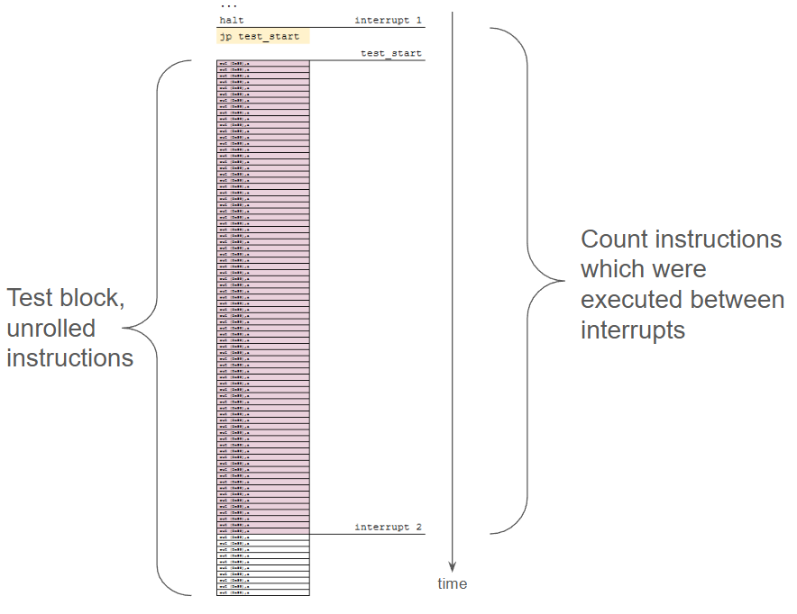
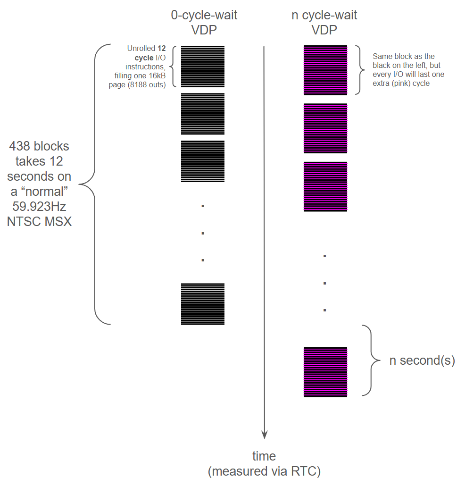
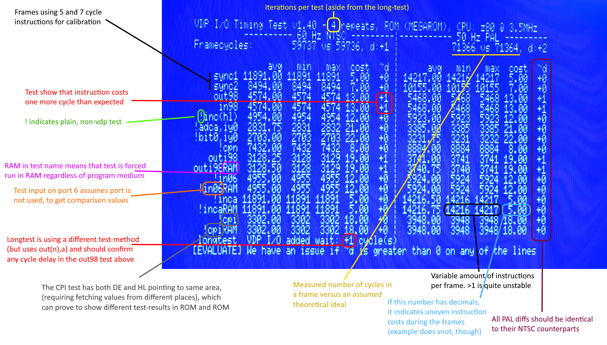

# VIOTT - VDP I/O Timing Tester
Test **MSX2 (and above)** VDPs for added wait cycles - typically reported on computers using the [MSX-Engine T9769A/B/C](https://www.msx.org/wiki/Toshiba_T9769). Turns out we can use it to measure instruction cycle cost in general. Written in C with help from assembly.

__Concept 1:__

* This (main) test counts how many of each instruction (from a set of selected ones) that can be executed in one frame.
* We measure multiple sets of the tests to see if there are any deviations (as [the interrupt seems to be a bit inaccurate at times](https://www.msx.org/forum/msx-talk/hardware/msx-engine-t9769b-does-it-really-add-2-wait-cycles#comment-470398)), and we then use the average and max values for further calculations.
* Running the code from internal memory is running at optimal speed with no delays, hence, ALL code that is not the "unrolled instructions", are put in RAM, this also includes any test setup code and the ISR both in DOS and in ROM mode.
* The tests are run in both 50Hz and 60Hz (screen will blink during test runs).

__Concept 2, the long test:__

* We execute so many unrolled outs that a +1 wait cycle on an I/O instruction will constitute one full second delay one VDPs with wait cycles, using NTSC. It spans 700+ frames. This second test is to validate other VDP tests. One test only and currently only used for VDP I/O, and it runs from RAM in dos mode and from ROM in rom-mode.

### Understanding the output ###

### Test results on various machines ###

### Dependencies & Build ##
* Tried to make this independent of various libraries. This to make everything as light and transparent as possible.
* Wanted to use as many BIOS-calls as possible, to reduce code and stay as easy to read for others.
* [SDCC](https://sdcc.sourceforge.net/) v4.2 or later, is needed though, to enable C.
* [MSXHex](https://aoineko.org/msxgl/index.php?title=MSXhex), the best ihx-to-binary tool for MSX
* Batch files are made for *Windows*, but should be easy to mod for other platforms. 
* If you use an emulator, edit `run.bat` to fit your paths/tools.

### Target platform / environment ###
* The _ROM_-variant (recommended) is a megarom using the ASCII-16 mapper. Find rom-file in `rom/`
* For the _MSXDOS_ variant you must provide DOS yourself. Find com-file in `dska/`.

### Download executable ###
You can download the latest pre-built `.com` file here: [/dska/viott.com](https://github.com/bengalack/viott/raw/refs/heads/main/dska/viott.com) and `.rom` here: [/rom/viott.rom](https://github.com/bengalack/viott/raw/refs/heads/main/rom/viott.rom)
